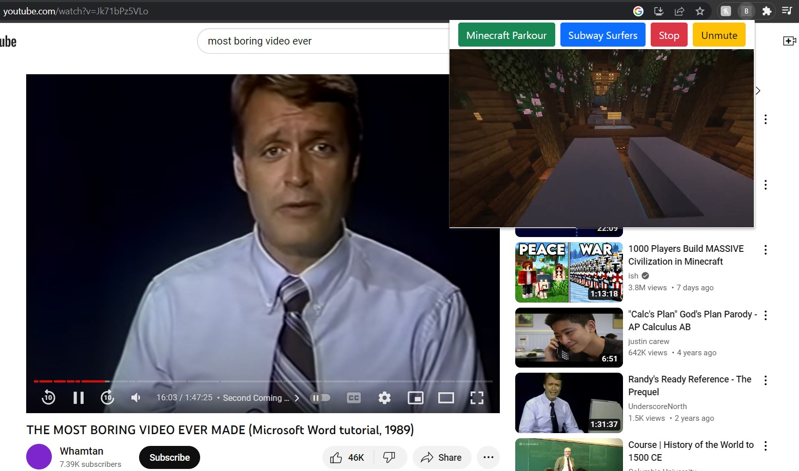

# BoringAhhPlugin
Chrome extension allowing users to open up a window of their favorite Minecraft parkour or Subway Surfers while bored. 
I did not want to pay the $5 to get this on the chrome webstore, but fun proof of concept.

**Note, I also did not commit my .mp4 videos as they were HUGE, so any .mp4's will be ignored from the .gitignore. If you wanted to use this, you would just have to add your own MP4s and then adjust the file paths accordingly**

